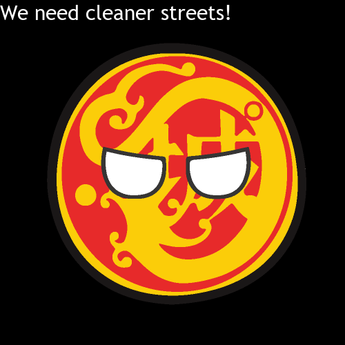

# hkdistrictballs
Create Hong Kong District Ball Graphics


Inspired by the "Country Balls" meme, this package allows you to create District Ball graphics with the eigthteen districts of Hong Kong. You can use these to create stories, craft messages to your District Councillors, or simply for fun!


## Installation

You can install the package from GitHub by running:

```
devtools::install_github("Hong-Kong-Districts-Info/hkdistrictballs")
```

## Creating a District Ball

Below is an example of how you can create a District Ball image:
```
library(hkdistrictballs)
generate_ball("kowloon-city", "fierce", scale = 500, vjust = 1.0, caption = "We need cleaner streets!", caption_size = 30)
```



You can also use functions from **magick** to combine plots:
```
ball_row <-
  c(generate_ball("wanchai"),
    generate_ball("kowloon-city", "skeptical"),
    generate_ball("sham-shui-po", "sad"))

magick::image_append(ball_row)
```


